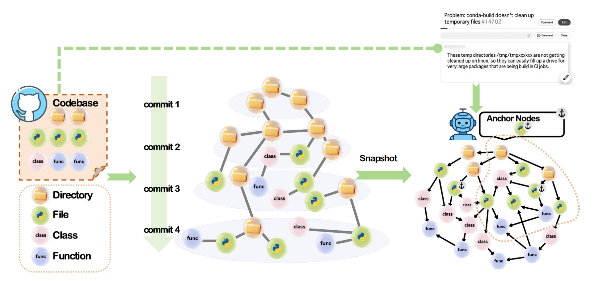

<h1 align="center">
   
  
   
  GREPO
   
</h1>

<h2 align="center">
  
  ：A BENCHMARK FOR GRAPH NEURAL NETWORKS ON REPOSITORY-LEVEL BUG LOCALIZATION
</h2>

  
  
  

  <a href="#env">Env</a> •
  <a href="#graph-building">Graph-building</a> •
  <a href="#crawling">Crawling</a> •
  <a href="#graph-feature-construction">Graph-Feature-Construction</a> •
  <a href="#gnn">GNN</a> •
  <a href="#license">License</a>

## 📦 Env
`conda env create -f repognn_environment.yaml`

## 🚩 Download Repository

Clone the repository you need for graph-building into the repos/ directory.

## 🎨 Graph-building

(The following examples are based on analyzing the repository of **conda**)

### 1.Run`BuildGraph/RepoAnalysis.py`

Remember to modify `repo_path = os.path.join("repos", args.name) ` in `RepoAnalysis.py` to point to your repository's location.

Hint: If the branches in the repository are not "main"/"master", you need to add your desired branch names in lines 426 to 439 of `RepoAnalysis.py`.

`python RepoAnalysis.py conda`

This will generate a `.arrow` file for each repo under `savadata/repos/.` After this process is completed, you can delete the cache files if they are no longer needed.

### 2.Run`BuildGraph/buildGraphTemporal.py`

Remember to check that the read path points to the data generated for each repository in the previous step (in `def build_graph`, the line `data = datasets.Dataset.load_from_disk(f"savedata/repos/{name}/")`).

`python buildGraphTemporal.py conda`

This will ultimately generate `pyggraph/{name}.timed.pt`.

## 🤖 Crawling

### 3.Run`Crawler/GithubRepoAnalysis.py`

`python GithubRepoAnalysis.py -o conda -n conda -c 1 -t {The access token for the github}`

After execution, the crawled pull request data will be saved at your specified `--save_path`.

### 4.Run`Crawler/issue_postpro.py`
Remember to check the paths first.

`python issue_postpro.py conda`

More simply, the Graph-building phase and crawling phase are two parallel steps. You can complete both at once by running `RepoDataset.py`, but please remember to check the paths in each code file mentioned above, as well as the paths in `RepoDataset.py`.

Execute both Graph-building phase and crawling phase simultaneously:
`python RepoDataset.py --repo_name conda -o conda -t github_pat_xxx --build`

Execute Graph-building phase only:
`python RepoDataset.py --repo_name conda -o conda -t github_pat_xxx --build --build_graph`

Execute crawling phase only:
`python RepoDataset.py --repo_name conda -o conda -t github_pat_xxx --build --build_label`

## 🔧 Graph-Feature-Construction
### 5.Run`Graph_Feature_Construction/run_full_generation.py`

`python run_full_generation.py --repo_name conda --batch_size 8 --output_dir Graph_Feature_Construction/get_content_embedding/conda`

This will generate node-content-embedding in Safetensor format at the specified path.

### 6.Run`Graph_Feature_Construction/GetPrompt.py`

`python GetPrompt.py --repo conda`

### 7.Run`Graph_Feature_Construction/inference.py`

Note: First, import your API key into the environment variable `"OPENAI_API_KEY"`.

`python inference.py --prompt_path /the/path/to/conda/test_rewriter_prompt.json --repo conda`

### 8.Run`Graph_Feature_Construction/post_process.py`

`python post_process.py --repo conda`

### 9.Run`Graph_Feature_Construction/generate_query_embeddings_ordered.py`

`python generate_query_embeddings_ordered.py --output_dir Graph_Feature_Construction/conda/query_embeddings_output_conda --repo conda`

### 10.Run`Graph_Feature_Construction/locate_anchor_node_patch.py`

Note: Check the paths in the code carefully.

`python locate_anchor_node_patch.py --repo conda`

## 🚀 GNN

### ⭐️ File-level Prediction

**Training from scratch:**

#### `single-repo-training：`

`python GNN/main.py --joint_training --repo conda --eval_freq -1 --eval_at_end --gnn_type gat --hidden_dim 128 --num_layers 4 --norm_type none --dropout 0.2 --input_dropout 0.05 --edge_dropout 0.15 --use_residual --residual_type concat --num_heads 4 --attention_dropout 0.2 --mlp_layers 3 --mlp_dropout 0.1 --learning_rate 0.000264 --weight_decay 0.0986 --loss_type bce_with_logits --pos_weight 100.0 --num_hops 1 --inferer_num_hops 1  --checkpoint_dir /path/to/save/checkpooint --query_cache_file /path/to/save/query_cache.pkl --evaluation_cache_dir /path/to/save/evaluation_cache`

#### `joint-training：`

`python GNN_Joint_Train/main.py --joint_training --repos astropy dvc ipython pylint scipy sphinx streamlink xarray geopandas --eval_freq -1 --eval_at_end --gnn_type gat --hidden_dim 128 --num_layers 4 --norm_type none --dropout 0.2 --input_dropout 0.05 --edge_dropout 0.15 --use_residual --residual_type concat --num_heads 4 --attention_dropout 0.2 --mlp_layers 3 --mlp_dropout 0.1 --learning_rate 0.000264 --weight_decay 0.0986 --loss_type bce_with_logits --pos_weight 100.0 --num_hops 1 --inferer_num_hops 1  --checkpoint_dir /path/to/save/checkpooint --query_cache_file /path/to/save/query_cache.pkl --evaluation_cache_dir /path/to/save/evaluation_cache` 

**Whether training on a single repository or joint training across multiple repositories, you can directly use the saved trained models, i.e., inference mode:**

Taking the joint training mode as an example, to use inference mode you only need to:
- Specify parameters identical to those of the saved model
- Additionally include the following arguments:
  - `--inference`
  - `--model_checkpoint` (specify the location of the saved model to be used)
  - `--inference_rewriter_path` (path to `rewriter_output_post_test.json` for the repository used as the test set)
  - `--inference_anchor_path` (path to `anchor_node_test.json` for the repository used as the test set)

`python GNN_Joint_Train/main.py --repo conda --gnn_type gat --hidden_dim 128 --num_layers 4 --norm_type none --dropout 0.2 --input_dropout 0.05 --edge_dropout 0.15 --use_residual --residual_type concat --num_heads 4 --attention_dropout 0.2 --mlp_layers 3 --mlp_dropout 0.1 --learning_rate 0.000264 --weight_decay 0.0986 --loss_type bce_with_logits --pos_weight 100.0 --num_hops 1 --inferer_num_hops 1 --query_cache_file /path/to/save/query_cache.pkl --inference --model_checkpoint /path/to/model.pth --inference_rewriter_path /path/to/somerepo/rewriter_output_post_test.json --inference_anchor_path /path/to/somerepo/anchor_node_test.json --evaluation_cache_dir /path/to/save/evaluation_cache`

**Whether training on a single repository or joint training across multiple repositories, you can directly resume training using saved trained models, i.e., the resume training mode**

Taking joint training mode as an example, to use the resume training mode, simply specify parameters identical to the saved model and add --resume_from (specifying the location of the saved model to be used).

### ⭐️ Function/Class-Level Prediction

To perform function/class-level prediction, this project provides a very easy approach. Whether you're training on a single repository or training across multiple repositories, simply complete the following two modifications:

- In `PrepareData.py`, change `gt_nodes = anchor_item.get('tarfiles_ids')` to `gt_nodes = anchor_item.get('patch_related_node_ids')` within the `prepare_training_data_fast` function.

- In `QueryAwareTrainer.py`, change `file_mask = (subset_types == 1) | (subset_types == 2)` to `file_mask = (subset_types == 3) | (subset_types == 4)` within the `create_inferer_filtered_subgraph` function.

**Training from Scratch:**

Taking joint training as an example, the usage for other modes remains consistent with the file-level scenario.

`python GNN_Joint_Train/main.py --joint_training --repos astropy dvc ipython pylint scipy sphinx streamlink xarray geopandas --eval_at_end --eval_freq -1 --gnn_type gatv2 --hidden_dim 32 --num_layers 5 --norm_type layer --dropout 0.1 --input_dropout 0.1 --edge_dropout 0.25 --use_residual --residual_type concat --num_heads 8 --attention_dropout 0.15 --mlp_layers 2 --mlp_dropout 0.1 --learning_rate 0.000897 --weight_decay 0.0174 --loss_type bce_with_logits --pos_weight 40.0 --num_hops 1 --inferer_num_hops 1 --checkpoint_dir /path/to/save/checkpooint --query_cache_file /path/to/save/query_cache.pkl --evaluation_cache_dir /path/to/save/evaluation_cache`

## 📜 License

[MIT](https://choosealicense.com/licenses/mit/)

